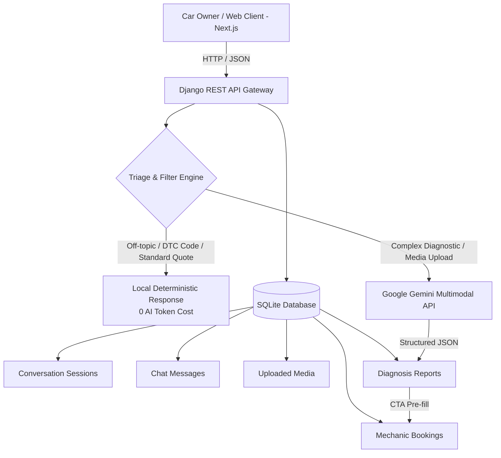

# 🚗 GearHead AI — Virtual Car Mechanic & Diagnostic Agent

> **48-Hour Full-Stack Developer Assessment Project**  
> A full-stack web application featuring an ASE Master Certified virtual automobile technician chatbot for troubleshooting, multimodal diagnostics (photo, sound, video), itemized repair estimation, and seamless mechanic booking.

---

## 🌟 Key Features

### 1. 🤖 Master Certified Mechanic Bot
- **Persona:** Acts as an authoritative, safety-conscious **Senior Automobile Master Technician** with 25+ years of diagnostic experience.
- **Automotive Domain Restriction:** Strictly handles vehicle mechanical, electrical, and maintenance queries; politely rejects off-topic queries without consuming unnecessary AI tokens.
- **Interactive Troubleshooting:** Inquires about specific symptoms, road speeds, and warning lights before forming a diagnosis.

### 2. 📸 Multimodal Media Inspection
- **Image Analysis:** Inspects photos of fluid leaks, tire tread wear, brake rotor grooves, dashboard warning lights, and OBD scanner readouts.
- **Acoustic Audio Analysis:** Identifies mechanical knocking, belt squeals, brake grinding, and clicking CV joint sound patterns.
- **Video Inspection:** Analyzes engine idle wobble, pulley vibration, and exhaust vapor/smoke colors.

### 3. 📉 AI Cost & Token Optimization Architecture
- **Traditional Rule-Based Triage Engine:** Handles greetings, standard maintenance pricing, off-topic rejection, and OBD-II trouble codes (`P0300`, `P0420`, `P0171`, `P0128`, `P0442`, etc.) entirely in local Django backend logic with **0 AI token cost**.
- **Gemini Free-Tier API Integration:** Google Gemini is invoked exclusively for complex multi-turn diagnostic reasoning, multimodal analysis, and final structured diagnosis generation.
- **Heuristic Fallback Engine:** If an API key is absent or rates are exceeded, the system falls back to an expert rule-based diagnostic engine.

### 4. 📋 Structured Diagnosis & "Book Mechanic" CTA
- Generates itemized diagnostic reports with **Issue Title, Severity Level (Low/Medium/High/Critical), Urgency, Safe-to-Drive status, Root Cause Breakdown, Recommended Repair Procedures, and Estimated Cost Ranges**.
- Displays an interactive **"Book Certified Mechanic"** CTA modal with workshop bay visits, doorstep mobile mechanic options, date/time scheduling, and instant booking confirmation code generation (`BK-XXXXXX`).

---

## 🏗️ System Architecture



---

## 📡 REST API Documentation

### Base URL: `http://localhost:8000/api`

| Method | Endpoint | Description |
|---|---|---|
| `GET` | `/api/health/` | System status and Gemini configuration check |
| `POST` | `/api/chat/` | Conversational message turn with triage and AI |
| `POST` | `/api/upload/` | Upload image, audio, or video for diagnostic analysis |
| `POST` | `/api/diagnosis/` | Generate structured diagnosis report for session |
| `POST` | `/api/booking/` | Schedule a certified mechanic appointment |
| `GET` | `/api/booking/{id}/` | Retrieve booking details and status by ID |
| `GET` | `/api/sessions/` | List recent diagnostic sessions |
| `GET` | `/api/history/{session_id}/` | Retrieve full message and media history for a session |
| `GET` | `/api/services/` | Standard service catalog with price benchmarks |

---

### API Request & Response Examples

#### 1. `POST /api/chat/`
**Request Body:**
```json
{
  "session_id": "optional-uuid-here",
  "message": "My 2019 Toyota Camry has a loud squeaking sound when applying brakes"
}
```
**Response (200 OK):**
```json
{
  "session_id": "a1b2c3d4-e5f6-7a8b-9c0d-1e2f3a4b5c6d",
  "response": "🛑 **Brake System Troubleshooting on your 2019 Toyota Camry**\n\nBrake noises and pedal feedback give direct clues...",
  "sender": "bot",
  "message_id": "msg-819234",
  "follow_ups": [
    "Grinding noise from front wheels",
    "Steering wheel vibrates when braking",
    "Book brake pad & rotor replacement"
  ],
  "is_diagnosis_ready": true,
  "is_ai_generated": true,
  "triage_tag": "gemini_ai",
  "car_context": {
    "year": 2019,
    "make": "Toyota",
    "model": "Camry",
    "mileage": null
  }
}
```

---

#### 2. `POST /api/upload/`
**Request:** `multipart/form-data` with `file` (image/audio/video), optional `session_id`, `media_type`.

**Response (201 Created):**
```json
{
  "media_id": "0b8595bb-97a9-45ad-a963-f75bc18ccf64",
  "session_id": "a1b2c3d4-e5f6-7a8b-9c0d-1e2f3a4b5c6d",
  "file_url": "http://localhost:8000/media/uploads/2026/09/24/brake_rotor.jpg",
  "file_type": "image",
  "original_filename": "brake_rotor.jpg",
  "file_size": 248910,
  "analysis": "Visual Inspection: Heavy concentric grooving detected on the brake disc surface...",
  "indicators": ["Rotor Wear Exceeded", "Ceramic Pad Glaze"]
}
```

---

#### 3. `POST /api/diagnosis/`
**Request Body:**
```json
{
  "session_id": "a1b2c3d4-e5f6-7a8b-9c0d-1e2f3a4b5c6d"
}
```
**Response (200 OK):**
```json
{
  "id": "diag-992384",
  "issue_title": "Worn Brake Pads & Glazed Rotors (Front Axle)",
  "primary_cause": "The friction lining on the front brake pads has worn down past the 3mm safety margin...",
  "severity": "medium",
  "urgency_level": "soon",
  "is_driveable": true,
  "symptoms": [
    "High-pitched acoustic squeal under moderate pedal pressure",
    "Slight pulsation in brake pedal at highway speeds"
  ],
  "suggested_repairs": [
    "Replace front brake pads with OEM ceramic compound",
    "Resurface or replace front vented brake rotors",
    "Perform brake fluid moisture test"
  ],
  "estimated_cost_range": "$220 - $380",
  "estimated_labor_hours": "1.5 - 2.0 hrs",
  "safety_warning": "Safe for short local trips, but avoid aggressive high-speed braking.",
  "diy_feasibility": "Moderate DIY (Requires Jack/Tools)",
  "recommended_service_name": "Front Brake Pad & Rotor Replacement",
  "cta_booking": {
    "recommended_service": "Front Brake Pad & Rotor Replacement",
    "estimated_cost": "$220 - $380",
    "car_make": "Toyota",
    "car_model": "Camry",
    "car_year": 2019,
    "severity": "medium",
    "is_driveable": true
  }
}
```

---

#### 4. `POST /api/booking/`
**Request Body:**
```json
{
  "session_id": "a1b2c3d4-e5f6-7a8b-9c0d-1e2f3a4b5c6d",
  "customer_name": "Alex Johnson",
  "customer_phone": "+1 (555) 234-5678",
  "customer_email": "alex@example.com",
  "car_make": "Toyota",
  "car_model": "Camry",
  "car_year": 2019,
  "car_mileage": "62,500 miles",
  "service_requested": "Front Brake Pad & Rotor Replacement",
  "service_type": "shop_visit",
  "preferred_date": "2026-09-28",
  "preferred_time": "10:30 AM",
  "notes": "Inspect rear pads as well please."
}
```
**Response (201 Created):**
```json
{
  "success": true,
  "booking_id": "BK-762837",
  "booking_details": {
    "id": "BK-762837",
    "customer_name": "Alex Johnson",
    "service_requested": "Front Brake Pad & Rotor Replacement",
    "status": "confirmed",
    "preferred_date": "2026-09-28",
    "preferred_time": "10:30 AM"
  },
  "confirmation_message": "Booking BK-762837 has been successfully scheduled for Alex Johnson on 2026-09-28 at 10:30 AM."
}
```

---

## 🚀 Quickstart Local Setup Guide

### Prerequisites
- Python 3.10+
- Node.js 18+ & npm
- (Optional) Google Gemini Free API Key from [Google AI Studio](https://aistudio.google.com/)

---

### Step 1: Backend Setup (Django)

```bash
cd backend

# 1. Create and activate virtual environment
python -m venv venv
# Windows:
.\venv\Scripts\activate
# macOS/Linux:
source venv/bin/activate

# 2. Install dependencies
pip install -r requirements.txt

# 3. Configure environment variables (.env)
cp .env.example .env
# Edit .env and paste your GEMINI_API_KEY (optional, fallback engine works out of the box!)

# 4. Run database migrations
python manage.py makemigrations api
python manage.py migrate

# 5. Run backend tests to verify endpoints
python test_api.py

# 6. Start Django development server
python manage.py runserver 8000
```
Backend API will be live at `http://127.0.0.1:8000/api/health/`.

---

### Step 2: Frontend Setup (Next.js)

```bash
cd frontend

# 1. Install dependencies
npm install

# 2. Configure environment
cp .env.example .env.local

# 3. Start Next.js development server
npm run dev
```
Frontend web application will be live at `http://localhost:3000`.

---

## 🌐 Production Deployment Guide

### Frontend Deployment on Vercel (Free Tier)
1. Push this repository to GitHub.
2. Go to [Vercel Dashboard](https://vercel.com/) -> **Add New Project**.
3. Import your repository and set the **Root Directory** to `frontend`.
4. In **Environment Variables**, add:
   - `NEXT_PUBLIC_API_URL` = `https://your-backend-api-url/api`
5. Click **Deploy**. Vercel will build and assign your live URL.

### Backend Deployment on AWS / Render / Railway (Free Tier)
1. **Render / Railway / AWS EC2**:
   - Build Command: `pip install -r requirements.txt && python manage.py migrate`
   - Start Command: `gunicorn mechanic_backend.wsgi:application --bind 0.0.0.0:$PORT`
2. Set Environment Variables:
   - `DJANGO_SECRET_KEY` = `<your-production-secret>`
   - `DEBUG` = `False`
   - `ALLOWED_HOSTS` = `*`
   - `GEMINI_API_KEY` = `<your-gemini-free-api-key>`
3. Set CORS allowed origins to your Vercel frontend URL.

---

## 🛠️ Technology Stack
- **Frontend:** Next.js 14, React 18, TypeScript, Tailwind CSS, Lucide Icons, Canvas Confetti.
- **Backend:** Python 3.13, Django 5.2, Django REST Framework, WhiteNoise, Gunicorn.
- **Database:** SQLite (Relational structure for Sessions, Messages, Media, Reports, Bookings).
- **AI / LLM:** Google Gemini 1.5/2.0 Flash with Multimodal Vision & Acoustic Analysis.
# CarMechanic

